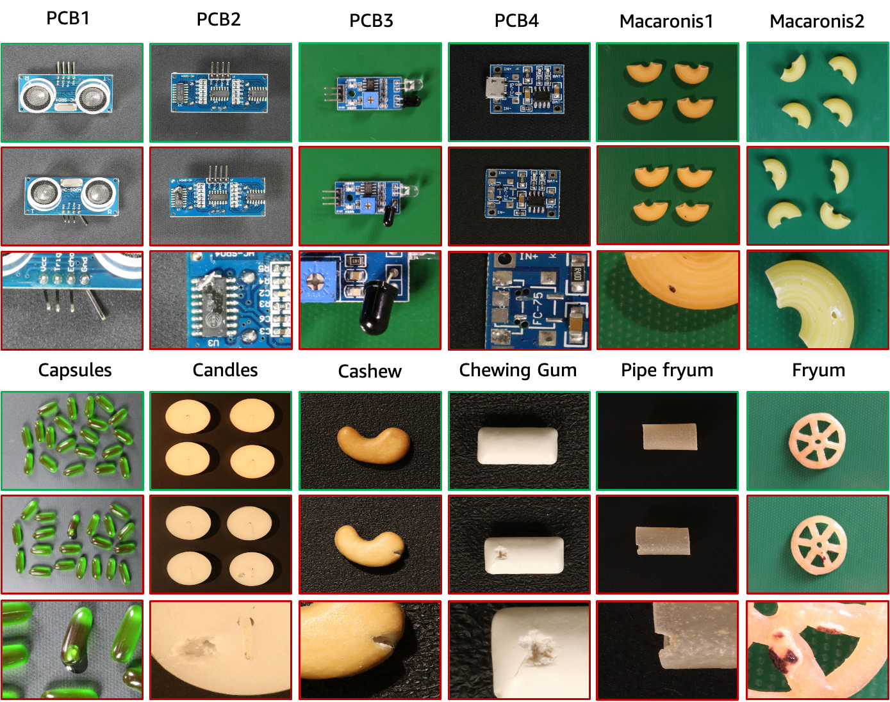

# SPot-the-Difference Self-Supervised Pre-training for Anomaly Detection and Segmentation

Yang Zou, Jongheon Jeong, Latha Pemula, Dongqing Zhang, Onkar Dabeer.

## Table of Contents
* [Introduction](#introduction)
* [Data description](#data-description)
* [Data statistics](#data-statistics)
* [Data download](#data-download)
* [Data preparation](#data-preparation)
* [Metric computation](#metric-computation)
* [Citation](#citation)
* [License](#license)

## Introduction
This repository contains the resources for our ECCV-2022 paper ["SPot-the-Difference Self-Supervised Pre-training for Anomaly Detection and Segmentation"](https://arxiv.org/pdf/2207.14315.pdf). Currently we release the Visual Anomaly (VisA) dataset. 

## Data description

The VisA dataset contains 12 subsets corresponding to 12 different objects as shown in the above figure. There are 10,821 images with 9,621 normal and 1,200 anomalous samples. Four subsets are different types of printed circuit boards (PCB) with relatively complex structures containing transistors, capacitors, chips, etc. For the case of multiple instances in a view, we collect four subsets: Capsules, Candles, Macaroni1 and Macaroni2. Instances in Capsules and Macaroni2 largely differ in locations and poses. Moreover, we collect four subsets including Cashew, Chewing gum, Fryum and Pipe fryum, where objects are roughly aligned. The anomalous images contain various flaws, including surface defects such as scratches, dents, color spots or crack, and structural defects like misplacement or missing parts. 

## Data statistics
| Object | # normal samples | # anomaly samples  | # anomaly classes | object type | 
|---|--------------|----------------|----------|-----------|
| PCB1 | 1,004 | 100 | 4 | Complex structure |
| PCB2 | 1,001 | 100 | 4 | Complex structure |
| PCB3 | 1,006 | 100 | 4 | Complex structure |
| PCB4 | 1,005 | 100 | 7 | Complex structure |
| Capsules | 602 | 100 | 5 | Multiple instances |
| Candles | 1,000 | 100 | 8 | Multiple instances |
| Macaronis1 | 1,000 | 100 | 7 | Multiple instances |
| Macaronis2 | 1,000 | 100 | 7 | Multiple instances |
| Cashew | 500 | 100 | 9 | Single instance |
| Chewing gum | 503 | 100 | 6 | Single instance |
| Fryum | 500 | 100 | 8 | Single instance |
| Pipe fryum | 500 | 100 | 6 | Single instance |

## Data download

We host the VisA dataset in AWS S3 and you can download it by this [URL](https://amazon-visual-anomaly.s3.us-west-2.amazonaws.com/VisA.tar). 

## Data preparation
In the downloaded "VisA" folder, for each object, all the anomalous and normal samples are stored in "Anomaly" and "Normal" subfolders. To prepare the 1-class, 2-class-highshot, 2-class-fewshot setups described in the [original paper](https://arxiv.org/pdf/2207.14315.pdf), we use the [prepare_data.py](https://github.com/amazon-research/spot-diff/blob/main/prepare_data.py) for reorganization, following the data splitting files in "./VisA/split_csv/". We give a sample command line for 1-class setup preparation as follows.
~~~~
python prepare_data.py --split-type 1cls --data-folder ./VisA --save-folder ./VisA_pytorch --split-file ./VisA/split_csv/1cls.csv
~~~~

The data tree of the reorganized 1-class setup is as follows.
```shell
VisA_pytorch
|-- 1cls
|-----|----- candle
|-----|-----|----- ground_truth
|-----|-----|----- test
|-----|-----|--------|------ good
|-----|-----|--------|------ bad
|-----|-----|----- train
|-----|-----|--------|------ good
|-----|----- capsules
|-----|----- ...
```

2-class setups can be prepared in a similar way by changing the arguments of prepare_data.py. 

## Metrics computation
To compute classification and segmentation metrics, please refer to [metrics.py](https://github.com/amazon-research/spot-diff/blob/main/metrics.py). Note that we take the normal samples into account when computing the localization metrics. This is different from some of the other works disregarding the normal samples in localization.

## Citation
Please cite the following paper if this dataset helps your project:

```bibtex
@article{zou2022spot,
  title={SPot-the-Difference Self-Supervised Pre-training for Anomaly Detection and Segmentation},
  author={Zou, Yang and Jeong, Jongheon and Pemula, Latha and Zhang, Dongqing and Dabeer, Onkar},
  journal={arXiv preprint arXiv:2207.14315},
  year={2022}
}
```

## License
The data is released under the CC BY 4.0 license.